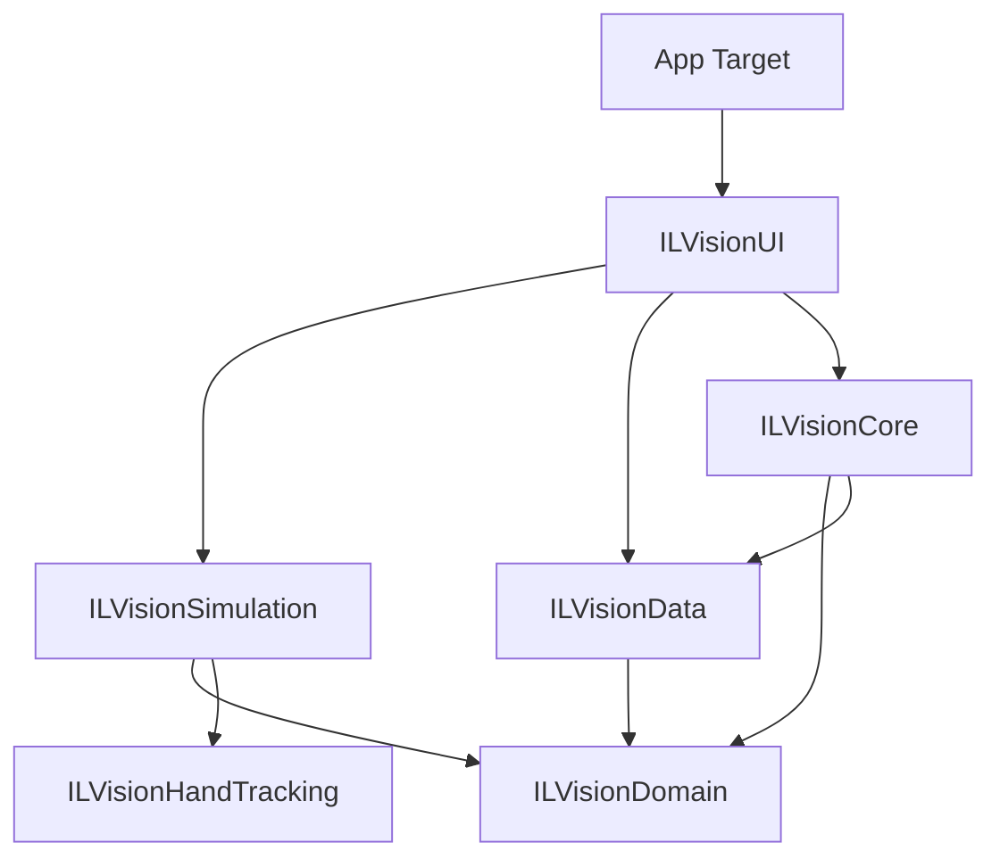

# ILVision Draw: Clean Architecture for visionOS

> A professional-grade spatial drawing application for Apple Vision Pro, demonstrating the fusion of **Clean Architecture (MVVM-C)** with **RealityKit ECS** and **SharePlay** collaboration.

---

## Table of Contents

- [Overview](#overview)
- [Architecture Philosophy](#architecture-philosophy)
- [Paradigm: MVVM-C + ECS Hybrid](#paradigm-mvvm-c--ecs-hybrid)
  - [The MVVM-Coordinator Pattern](#the-mvvm-coordinator-pattern)
  - [Entity Component System (ECS)](#entity-component-system-ecs)
  - [The Bridge Layer](#the-bridge-layer)
- [Module Architecture (SPM)](#module-architecture-spm)
  - [Dependency Graph](#dependency-graph)
  - [Module Responsibilities](#module-responsibilities)
- [Project Structure](#project-structure)
- [Data Flow](#data-flow)
  - [End-to-End Trace: Spatial Drawing](#end-to-end-trace-spatial-drawing)
- [Concurrency Model](#concurrency-model)
  - [Main Actor Isolation](#main-actor-isolation)
  - [Async/Await Boundaries](#async-await-boundaries)
- [App Entry Point](#app-entry-point)
  - [Scene Architecture](#scene-architecture)
  - [Dependency Injection](#dependency-injection)
- [Dependencies](#dependencies)

---

## Overview

**ILVision Draw** is a high-performance spatial computing application that allows users to create 3D drawings in their physical environment using natural hand gestures. 

The project serves as a reference implementation for **enterprise-scale visionOS development**, prioritizing:
- **Modularization**: 100% of business and simulation logic resides in local Swift Packages.
- **Strict Concurrency**: Fully compliant with Swift 6 strict concurrency checks.
- **Collaborative UX**: Built-in SharePlay support for real-time multi-user drawing.
- **Hardware Abstraction**: Isolated hand-tracking logic for maximum reusability.

| Feature | Technology | Purpose |
|---------|------------|---------|
| **3D Rendering** | RealityKit | High-performance spatial drawing canvas |
| **Interaction** | ARKit | Custom "Pinky-to-Draw" hand gesture detection |
| **State Mgmt** | MVVM-C | Predictable UI state and navigation flow |
| **Collaboration** | GroupActivities | Real-time synchronization via SharePlay |

---

## Architecture Philosophy

The architecture is governed by **three core principles**:

**1. Strict Domain Separation.** No module reaches into another module's internal domain. The `ILVisionSimulation` handles the 3D world; `ILVisionUI` handles the menus. They communicate only through protocols defined in the `ILVisionDomain` layer.

**2. Unidirectional Data Flow.** State updates flow from Repositories → UseCases → ViewModels → Views. User actions flow back down through the same chain. This ensures that the single source of truth is always predictable.

**3. Protocol-Based Abstraction.** The Domain layer defines *what* should happen (Protocols), and the Data layer defines *how* (Implementations). This decoupling allows for easy unit testing and swappable data sources (e.g., Mock vs. Live SharePlay).

---

## Paradigm: MVVM-C + ECS Hybrid

The project bridges two fundamentally different state management worlds:

1. **MVVM-C** for application state: User preferences, UI navigation, and SharePlay session lifecycle.
2. **ECS** (Entity Component System) for 3D state: Entity positions, collision detection, and per-frame rendering at 90fps.

### The MVVM-Coordinator Pattern

Used for the "Presentation Layer" to manage windows and application state:

| Component | Role | Implementation |
|-----------|------|----------------|
| **Coordinator** | Handles navigation and scene lifecycle | `AppCoordinator` — manages the transition to ImmersiveSpace. |
| **ViewModel** | Orchestrates state for a specific View | `DrawingViewModel` — manages brush color and stroke width. |
| **Model** | Observable state containers | `AppModel` — the central `@Observable` state for SwiftUI. |

### Entity Component System (ECS)

RealityKit's ECS is optimized for high-frequency updates where latency must be minimal:

| Concept | Role | Example |
|---------|------|---------|
| **Entity** | A container for data in the 3D scene | `CanvasEntity`, `DrawController` |
| **Component** | Pure data attached to an entity | `DrawingComponent(color: .red, radius: 0.01)` |
| **System** | Logic that runs every frame | `DrawingSystem` — detects hands and spawns dots. |

### The Bridge Layer

The Bridge Layer is how the "UI World" tells the "Simulation World" what to do:

- **AppModelServiceComponent**: A weak reference bridge that allows ECS Systems to read from the SwiftUI `AppModel` without owning it.
- **SharePlayReceiverComponent**: Connects the `SharePlayManager` to the ECS world to render incoming remote strokes.

---

## Module Architecture (SPM)

The project is organized into **6 local Swift Packages** to enforce strict boundaries and improve compilation speed.

### Dependency Graph



### Module Responsibilities

1. **`ILVisionDomain`**: The heart of the app. Contains pure Business Logic, Models, and Repository Protocols. Zero dependencies.
2. **`ILVisionData`**: Concrete implementations of repositories. Handles SharePlay sessions, Networking, and Local Storage.
3. **`ILVisionCore`**: The Dependency Injection (DI) hub. Wires the concrete Data implementations into the Domain protocols.
4. **`ILVisionHandTracking`**: A technical utility package. Wraps ARKit Hand Tracking into a reusable RealityKit System.
5. **`ILVisionSimulation`**: The RealityKit world. Contains ECS Components and Systems for the drawing logic.
6. **`ILVisionUI`**: The Presentation layer. Contains SwiftUI Views, ViewModels, and the AppCoordinator.

---

## Project Structure

```
CleanArchitectureVisionOS/
├── App/                          ← Xcode Target
│   ├── CleanDrawApp.swift        ← Entry point & Scene definitions
│   └── Info.plist                ← Permissions & Multi-scene support
│
├── Packages/                     ← Local SPM Packages
│   ├── ILVisionDomain/           ← Domain (Models & Protocols)
│   ├── ILVisionData/             ← Data (SharePlay & Repositories)
│   ├── ILVisionCore/             ← Core (DI & Injection)
│   ├── ILVisionHandTracking/     ← Hardware (ARKit Hand Tracking)
│   ├── ILVisionSimulation/       ← Simulation (RealityKit ECS)
│   └── ILVisionUI/               ← Presentation (Views & ViewModels)
│
└── README.md
```

---

## Data Flow

### End-to-End Trace: Spatial Drawing

1. **Input**: `HandTrackingSystem` (in `ILVisionHandTracking`) updates the `latestRightHand` anchor from ARKit.
2. **Detection**: `DrawingSystem` (in `ILVisionSimulation`) runs its per-frame update and detects the "Pinky Extended" gesture.
3. **Simulation**: The system reads the current brush settings from `AppModel` via the `AppModelServiceComponent`.
4. **Mutation**: If the gesture is active, the system spawns a `ModelEntity` dot on the `Canvas`.
5. **Sync**: The system calls `ILVisionInjection.shared.sharePlayManager.sendStroke()` to broadcast the dot to other users.
6. **Remote**: Other users receive the message; their `DrawingSystem` reads from the `SharePlayReceiverComponent` and spawns the remote dot.

---

## Concurrency Model

The project is built for **Swift 6 Strict Concurrency**.

### Main Actor Isolation
- All UI-facing components (`ViewModels`, `Coordinators`, `AppModel`) are isolated to the **`@MainActor`**.
- The `ILVisionInjection` container is `@MainActor` to ensure thread-safe dependency resolution.
- The `DrawingSystem` (RealityKit System) is marked `@MainActor` to safely access shared application state.

### Async/Await Boundaries
- **SharePlay Listener**: Runs in a long-lived `Task` within the App entry point.
- **Hand Tracking**: ARKit session lifecycle is managed asynchronously via `await HandTrackingSystem.runSession()`.
- **Broadcasts**: SharePlay messages are sent using `Task { await ... }` to avoid blocking the high-frequency render loop.

---

## App Entry Point

### Scene Architecture

The app uses multiple scenes to provide a focused control interface alongside the immersive experience:

- **WindowGroup ("main")**: The primary dashboard for managing settings.
- **WindowGroup ("controls")**: A secondary palette window for color selection.
- **ImmersiveSpace ("drawingSpace")**: The 3D canvas where spatial drawing occurs.

### Dependency Injection

We use an explicit, property-based DI container in `ILVisionCore`. This avoids the "Magic" of hidden DI frameworks while maintaining clean boundaries:

```swift
@MainActor
public struct ILVisionInjection {
    public static let shared = ILVisionInjection()
    
    public let useCase: DrawingSettingsUseCase
    public let sharePlayManager: SharePlayManager
    
    private init() {
        // Wiring happens here: DataSource -> Repository -> UseCase
        let ds = DrawingSettingsDataSourceImpl()
        let repo = DrawingSettingsRepositoryImpl(dataSource: ds)
        self.useCase = DrawingSettingsUseCaseImpl(repository: repo)
        self.sharePlayManager = SharePlayManager()
    }
}
```

---

## Dependencies

- **visionOS 2.0 (v26.0)**: Requires the latest spatial features for Hand Tracking and SharePlay.
- **GroupActivities**: Used for the collaborative backend.
- **RealityKit**: Primary rendering engine.
- **ARKit**: Used for skeletal hand tracking.
