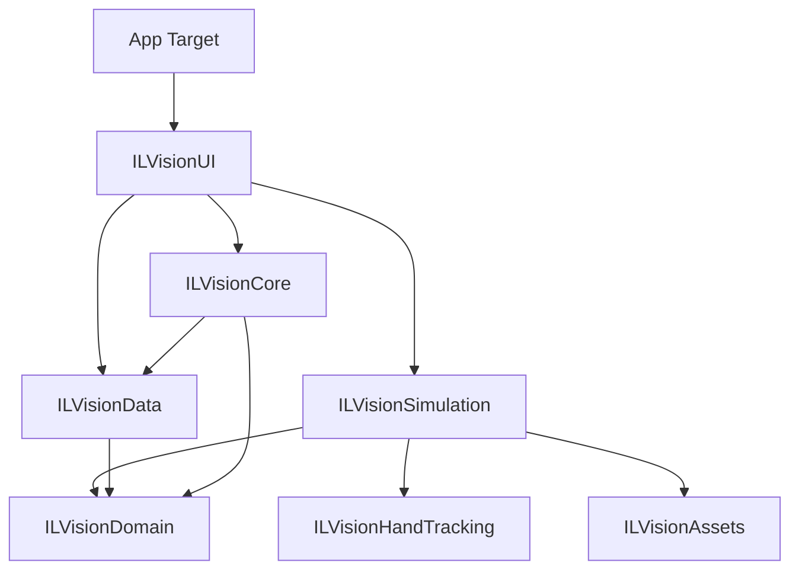

# ILVision Enterprise Architecture

> A high-fidelity, modular framework for building immersive Mixed Reality (MR) flight simulation and training applications on Apple Vision Pro.

---

## Table of Contents

- [Overview](#overview)
- [Architecture Philosophy](#architecture-philosophy)
- [Paradigm: MVVM-C + ECS Hybrid](#paradigm-mvvm-c--ecs-hybrid)
  - [The MVVM-Coordinator Pattern](#the-mvvm-coordinator-pattern)
  - [Entity Component System (ECS)](#entity-component-system-ecs)
  - [The Bridge Layer](#the-bridge-layer)
- [Module Architecture (SPM)](#module-architecture-spm)
  - [Dependency Graph](#dependency-graph)
  - [Module Responsibilities](#module-responsibilities)
- [Project Structure](#project-structure)
- [Data Flow](#data-flow)
  - [End-to-End Trace: Cockpit Lever Interaction](#end-to-end-trace-cockpit-lever-interaction)
- [Concurrency Model](#concurrency-model)
  - [Actor Isolation Strategy](#actor-isolation-strategy)
  - [Threading Boundaries](#threading-boundaries)
- [Asset Management](#asset-management)
  - [Separation of Concerns: The Art Team Workflow](#separation-of-concerns-the-art-team-workflow)
- [Key Implementation Examples](#key-implementation-examples)
  - [Dependency Injection (ILVisionCore)](#dependency-injection-ilvisioncore)
  - [ECS-SwiftUI Bridge (AppModelServiceComponent)](#ecs-swiftui-bridge-appmodelservicecomponent)
- [Dependencies](#dependencies)

---

## Overview

**ILVision** is designed to solve the core engineering challenges of spatial computing: bridging complex, high-frequency 3D simulation states with transactional, predictable UI state management. 

The framework enables teams of developers and artists to work in parallel on a single codebase by enforcing strict binary boundaries between hardware interaction, business logic, and visual assets.

---

## Architecture Philosophy

The architecture is governed by **three non-negotiable principles**:

**1. Strict Domain Separation.** No module reaches into another module's internal implementation. `ILVisionSimulation` (3D) has zero knowledge that `ILVisionUI` (SwiftUI) exists. They communicate only through the `ILVisionDomain` layer.

**2. Unidirectional Data Flow.** State mutations happen in exactly one place: the `@MainActor` isolated `@Observable` state. All asynchronous results—hand tracking, physics ticks, network messages—re-enter the system as explicit state updates.

**3. Actor Isolation at Async Boundaries.** Swift 6 strict concurrency is fully adopted. Modules crossing thread boundaries use `actor` isolation, and all shared types conform to `Sendable`.

---

## Paradigm: MVVM-C + ECS Hybrid

The project manages two fundamentally different state management worlds:

- **MVVM-C** for application state: User sessions, training progress, 2D panels, and navigation flow.
- **ECS** (Entity Component System) for 3D state: Lever positions, cockpit animations, collision detection, and spatial audio.

### The MVVM-Coordinator Pattern

Used for the "Presentation Layer" to manage windows and user flow:

| Component | Role | Implementation |
|-----------|------|----------------|
| **Coordinator** | Navigation & Scene Lifecycle | `AppCoordinator` — Orchestrates transitions between Shared Space and Immersive Space. |
| **ViewModel** | UI State Orchestration | `DrawingViewModel` — Transforms domain data into view-ready state. |
| **Model** | Central State | `AppModel` — A single `@Observable` source of truth for the UI. |

### Entity Component System (ECS)

RealityKit's ECS is the standard for 3D content, running at 90fps:

| Concept | Role | Example |
|---------|------|---------|
| **Entity** | A 3D object in the world | `throttleLeverEntity` |
| **Component** | Pure data attached to an entity | `ThrottleComponent(value: 0.72)` |
| **System** | Logic running every frame | `FlightSystem` — Iterates entities with `ThrottleComponent` to calculate thrust. |

### The Bridge Layer

The Bridge Layer translates between the two worlds without coupling them:

```
ECS Interaction Event ──→ Service/Repository ──→ AppModel Update  (Simulation tells UI)
AppModel State Change ──→ Component Update   ──→ ECS Frame Update (UI tells Simulation)
```

---

## Module Architecture (SPM)

The project is broken into **7 local Swift Packages**, enforcing explicit public interfaces.

### Dependency Graph



### Module Responsibilities

| Layer | Module | Purpose |
| :--- | :--- | :--- |
| **Foundation** | `ILVisionDomain` | Core Models (`User`, `FlightState`) and Repository Protocols. |
| **Hardware** | `ILVisionHandTracking` | ARKit Skeleton wrappers and custom gesture detection. |
| **Assets** | `ILVisionAssets` | Reality Composer Pro project and 3D binary assets. |
| **Simulation** | `ILVisionSimulation` | ECS Systems, Components, and 3D Interaction logic. |
| **Data** | `ILVisionData` | SharePlay synchronization, Persistence, and Networking. |
| **Presentation** | `ILVisionUI` | SwiftUI Views, ViewModels, and the AppCoordinator. |
| **DI Hub** | `ILVisionCore` | The Glue—Wires concrete implementations into Domain protocols. |

---

## Project Structure

```
CleanArchitectureVisionOS/
├── App/                          ← Xcode Target (Thin orchestration)
│   ├── CleanDrawApp.swift        ← @main entry point, Scene architecture
│   └── Info.plist                ← Capabilities (SharePlay, Multiple Scenes)
│
├── Packages/                     ← 100% Local Modular logic
│   ├── ILVisionDomain/           ← The "Brain" (Pure Swift, No dependencies)
│   ├── ILVisionData/             ← The "Memory" (SharePlay, Repositories)
│   ├── ILVisionCore/             ← The "Glue" (Dependency Injection)
│   ├── ILVisionHandTracking/     ← The "Nerves" (ARKit/Hardware)
│   ├── ILVisionSimulation/       ← The "Body" (RealityKit ECS)
│   ├── ILVisionUI/               ← The "Face" (SwiftUI Views/ViewModels)
│   └── ILVisionAssets/           ← The "Skin" (3D Models/Art Assets)
│
└── README.md
```

---

## Data Flow

### End-to-End Trace: Cockpit Lever Interaction

Traces a single user gesture—pulling the landing gear lever—through every layer:

1.  **T0 [Hardware / ARKit]**: `HandTrackingSystem` detects the right hand's position and the "Grab" gesture.
2.  **T1 [Simulation / ECS]**: `InteractionSystem` finds the lever entity. It updates the lever's visual rotation at 90fps for instant haptic/visual feedback.
3.  **T2 [Simulation / Component]**: The system updates the `GearLeverComponent` with the new state (e.g., `.lowering`).
4.  **T3 [Bridge / MainActor]**: A weak-reference bridge calls `ILVisionInjection.shared.flightRepository.updateGearState(.lowering)`.
5.  **T4 [Domain / State]**: The `AppModel` updates. SwiftUI detects the state change.
6.  **T5 [UI / SwiftUI]**: The instrument panel view re-renders, showing the landing gear lights transitioning from Green to Red.
7.  **T6 [Data / SharePlay]**: `SharePlayManager` broadcasts the gear state update to all other participants in the cockpit.

---

## Concurrency Model

### Actor Isolation Strategy

- **`@MainActor`**: 100% of the UI layer, ViewModels, and the DI Container are isolated here to prevent race conditions on state updates.
- **`@globalActor`**: (Future) Physics calculations or heavy data processing can be isolated to a custom global actor to avoid blocking the Main thread.
- **RealityKit Systems**: Run on the system's render thread but use `@MainActor` to safely access shared application state.

---

## Asset Management

### Separation of Concerns: The Art Team Workflow

The `ILVisionAssets` package provides a **Firewall** between Art and Code:

1.  **Artists** work exclusively in the `RealityContent.rkassets` folder using **Reality Composer Pro**.
2.  **Tech Artists** expose entities using **Components** in RCP.
3.  **Developers** load the assets via `ILVisionAssets.bundle` and query for entities with specific components.
4.  **Benefit**: No Git merge conflicts on the `.xcodeproj` when an artist adds a 3D model.

---

## Key Implementation Examples

### Dependency Injection (ILVisionCore)

```swift
@MainActor
public struct ILVisionInjection {
    public static let shared = ILVisionInjection()
    
    public let sharePlayManager: SharePlayRepository
    
    private init() {
        // Wire concrete implementation to protocol
        self.sharePlayManager = SharePlayManager()
    }
}
```

### ECS-SwiftUI Bridge (AppModelServiceComponent)

```swift
/// Attached to a 'Controller' entity in the scene to bridge the UI Model to ECS
public struct AppModelServiceComponent: Component {
    public weak var appModel: AppModel?
    
    public init(appModel: AppModel) {
        self.appModel = appModel
    }
}
```

---

## Dependencies

- **visionOS 2.0 (v26.0)**: Required for Skeletal Hand Tracking and GroupActivities enhancements.
- **GroupActivities**: Real-time collaborative state synchronization.
- **RealityKit**: High-performance 3D rendering.
- **ARKit**: Hand tracking and scene understanding.
